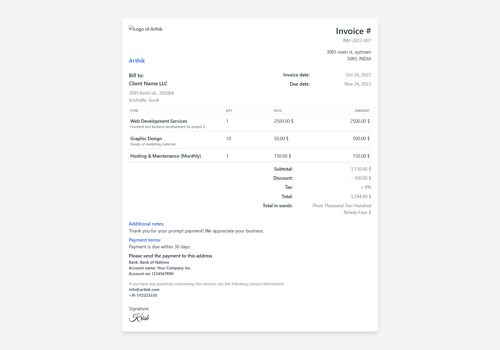
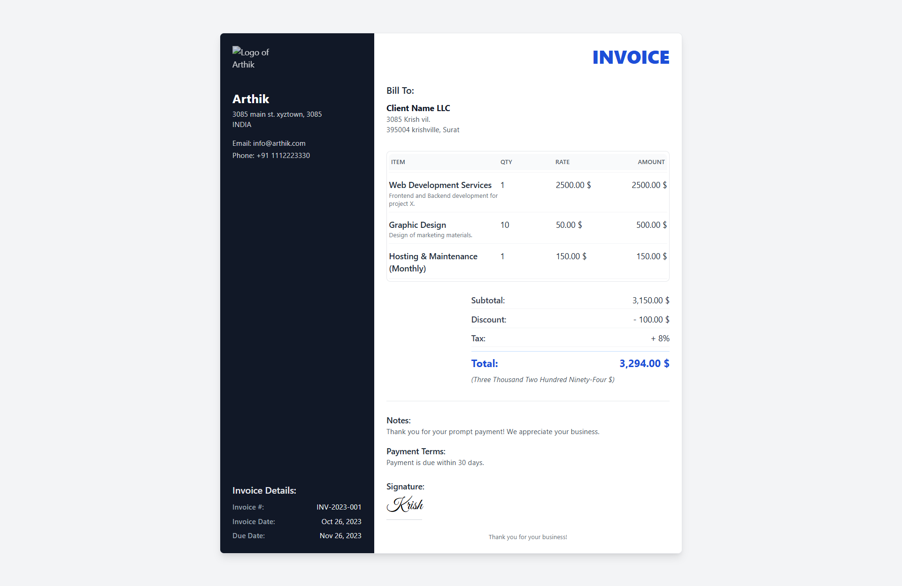

# Arthik

Arthik is a web-based invoice generator application built with Next.js, TypeScript, React, and the Shadcn UI library. It provides an easy way to create and manage professional invoices.

## Table of Contents

- [Arthik](#arthik)
  - [Table of Contents](#table-of-contents)
  - [Technologies](#technologies)
    - [Core Technologies](#core-technologies)
    - [Additional Dependencies](#additional-dependencies)
  - [Roadmap](#roadmap)
  - [Demo](#demo)
  - [Preview of Templates](#preview-of-templates)
  - [Getting Started](#getting-started)
    - [Prerequisites](#prerequisites)
    - [Installation](#installation)
  - [License](#license)


## Technologies

### Core Technologies

- **Next.js:** React framework for SSR and client-side navigation.
- **TypeScript:** JavaScript superset with static typing.
- **Shadcn-UI:** UI library for enhanced visuals.
- **Tailwind:** Utility-first CSS framework.
- **React Hook Form:** Form management for React.
- **Zod:** TypeScript-first schema validation.
- **Puppeteer:** PDF generation with headless browsers.

### Additional Dependencies

- **Nodemailer:** Node.js module for sending emails.
- **Lucide Icons:** Collection of customizable SVG icons.

## Roadmap

- We are curretly working on this project and will add more features soon !s

- [x] **Easily Create Invoices:** Utilize a simple form to quickly generate invoices.
- [x] **Save for Future Access:** Store your invoices directly in your browser for easy retrieval.
- [x] **Retrieve Invoices Effortlessly:** Load and access invoices seamlessly from your saved list.
- [x] **Flexible Download Options:** Download invoices directly or send them via email in PDF format.
- [x] **Template Variety:** Choose from multiple (currently 2) invoice templates.
- [x] **Live Preview:** Edit the form and see changes in real-time with the live preview feature.
- [x] **Export in Various Formats:** Export invoices in different formats, including JSON, XLSX, CSV, and XML.
- [ ] **I18N Support:** i18n support with multiple languages for UI and templates.
- [ ] **Themeable Templates:** Select a theme color for the invoice
- [ ] **Custom Inputs:** Define your own inputs that are missing from the default invoice builder. (Ex: VAT number)
- [ ] **Individual Tax for Line Items:** Add tax details for a specific line item other than the general tax

## Preview of Templates

Template 1:


## Demo

Visit the [live demo](will add soon !) to see Arthik in action.

## Preview of Templates

Template 1:


Template 2:


Template 3:


Template 4:


## Getting Started

Follow these instructions to get Arthik up and running on your local machine.

### Prerequisites

- Node.js and npm installed on your system.

### Installation

1. Clone the repository:

   ```bash
   git clone https://github.com/harsh-kakadiya1/Arthik-invoice-management.git
   cd Arthik
   ```
2. Install dependencies
   
   ```bash
   npm install
   ```
3. Create an .env.local file with this content (This step is for sending pdf to email feature):
   ```env
   NODEMAILER_EMAIL=your_email@example.com
   NODEMAILER_PW=your_email_password
   ```
4. Start development server

    ```bash
    npm run dev
    ```
5. Open your web browser and access the application at [http://localhost:3000](http://localhost:3000)
<!-- LICENSE -->
## License

Distributed under the MIT License. See `LICENSE.txt` for more information.
